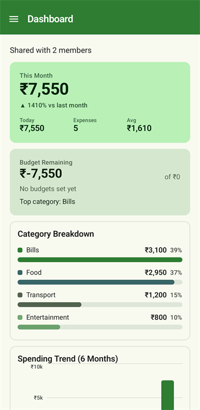
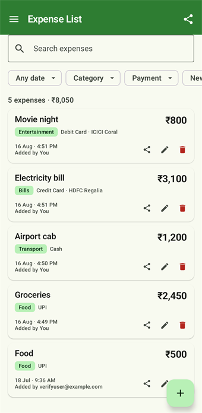
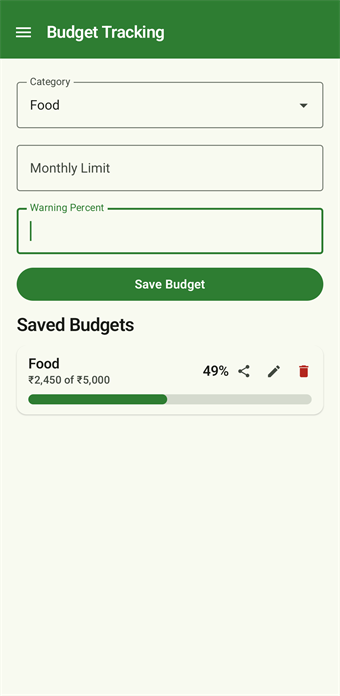
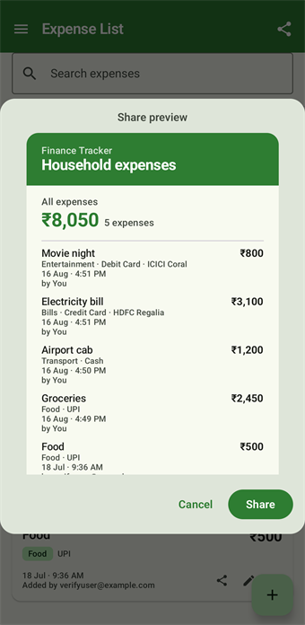
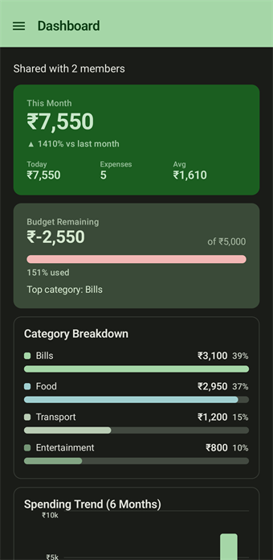
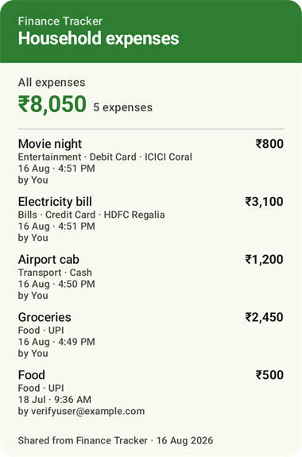

# Finance Tracker

A shared expense tracker for a household. Two to four people log what they spend, and everyone sees the same numbers on their own phone, updated live.

Built for my own family, so it optimises for a small trusted group rather than for scale — no ledgers, no settling up, just a straight answer to "what did we spend this month, and on what?"

**[Download the latest APK →](https://github.com/grvig/finance-tracker-android/releases/latest)**

Requires Android 8.0 (API 26) or newer.

---

## Screenshots

<p>
  
  
  
</p>

<p>
  
  
</p>

Any list, expense, budget or report can be exported as an image and sent through the share sheet. Exports stay light-themed regardless of the sender's theme:

<p>
  
</p>

---

## What it does

**Shared, live**
Sign in with email, create a household or join one with a 6-character code. Everything is scoped to that household. When one person adds an expense, it appears on everyone else's phone straight away — no refresh button anywhere in the app.

**Expenses**
Amount, category, payment method, card name, date, time, description and notes. Every expense records who added it.

**Filter and sort**
Search, plus filters for date range (this week, this month, last 30 days, or a custom range), category and payment method, and sorting by date or amount. A running count and total reflects whatever is currently on screen. Tapping a category on the Dashboard or Reports jumps straight to those expenses.

**Budgets**
Monthly limits per category with a warning threshold, shown as a progress bar against actual spending.

**Recurring expenses**
Weekly or monthly bills that turn themselves into real expenses when they come due. Generation is transactional, so a bill is only ever logged once no matter how many household members open the app at the same time.

**Reports**
Per-month totals, category breakdown, and per-member spending.

**Share as an image**
Any expense, filtered list, budget, recurring bill or monthly report can be rendered to a PNG and sent through the Android share sheet. Exports are always light-themed so they stay readable for whoever receives them.

**Odds and ends**
A home screen widget and a long-press app shortcut that jump straight to the Add Expense form, and a light / dark / follow-system theme setting.

---

## Built with

| | |
|---|---|
| Language | Kotlin 2.2 |
| UI | Jetpack Compose, Material 3 |
| Auth & data | Firebase Auth (email/password), Cloud Firestore |
| Architecture | MVVM — Repository → ViewModel → Composable |
| Async | Coroutines and Flow; Firestore snapshot listeners exposed as `StateFlow` |
| Charts | Hand-drawn on Compose `Canvas` — no charting library |
| Min / target SDK | 26 / 36 |

No dependency injection framework — ViewModels are wired with hand-written factories. Navigation is an enum plus a `mutableStateListOf` back stack rather than the Navigation component; the app is small enough that this stays readable.

---

## Project layout

```
app/src/main/java/com/grvig/financetracker/
├── data/            Plain data classes (Expense, Budget, RecurringExpense, Household, UserProfile)
├── repository/      Firestore reads/writes, live queries as callbackFlow
├── viewmodel/       ViewModels and their factories
├── ui/theme/        Colour scheme, typography
├── *Screen.kt       One file per screen
├── ExpenseFilters   Filtering/sorting model — pure Kotlin, unit tested
├── ShareCard.kt     The layouts that get rendered to PNG
└── MainActivity.kt  Navigation back stack, drawer, theme wiring
```

---

## Building it yourself

You'll need Android Studio — its bundled JDK is sufficient.

This app is wired to my Firebase project, so a clone won't authenticate against it. To run your own:

1. Create a Firebase project, add an Android app with the applicationId `com.grvig.financetracker` (or change it in `app/build.gradle.kts`).
2. Enable **Authentication → Email/Password** and create a **Cloud Firestore** database.
3. Download your own `google-services.json` and replace `app/google-services.json`.
4. Publish the rules in [`firestore.rules`](firestore.rules) — they scope every read and write to members of the household.

Then:

```bash
./gradlew installDebug
```

### Release builds

Release signing reads from a `keystore.properties` at the repo root, which is gitignored along with the keystore itself:

```properties
storeFile=keystore.jks
storePassword=...
keyAlias=...
keyPassword=...
```

Without that file, debug builds still work — the signing config is skipped.

```bash
./gradlew assembleRelease
```

---

## Tests

Filtering, sorting and label formatting are pure functions and covered by unit tests:

```bash
./gradlew testDebugUnitTest
```

Screens are verified by hand on an emulator.

---

## Releases

| Version | Highlights |
|---|---|
| **1.3** | Live sync, home screen widget, dark mode, new app icon, recurring duplicate fix |
| **1.2** | Filter/sort system, PNG sharing, UI modernisation, card names |
| **1.1** | Navigation drawer, green Material 3 theme, charts rebuilt, My Expenses |
| **1.0** | Multi-user households on Firebase |
